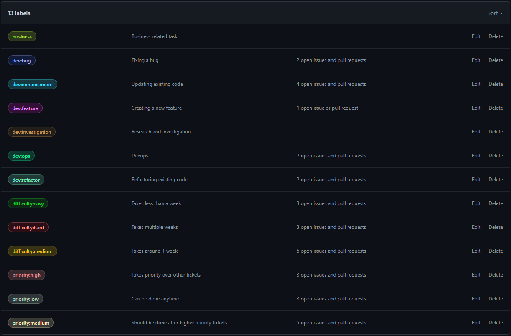

# Developer Guide #
Your guide to developing at Nomad!  

---

## Git Hygiene ##

#### Issues ####
Issues should be created whenever an actionable arises. Ideally, issues should take no longer than a few weeks to complete. When a large actionable, lets say a new feature request, needs to be completed, it should be broken down into one to two week chunks.

When creating an issue, give it a concise name and detailed description; each issue comes with the following description template:  
```
# Background
<!--- Put any relevant background information here. --->

# Task
<!--- Put the task here (ideally bullet points). --->
```

Be sure to label the issue with the **3 labels**. One label should describe the type of actionable, one label should describe the difficulty, and one label should describe the priority of the issue. Here are the available labels and their descriptions:




#### Pull Requests ####

Whenever a change is to be made to the codebase, a developer should create a feature branch (can be any name but should be relevant to the changes being made) and open a pull request. The title of the pull request should contain a concise summary of the changes being made and the description of the pull request should follow the following template:
```
# Relevant issue
<!--- Put the issue number here. --->
Closes # (issue)

# Summary of change
<!--- Describe the change that this pull request makes. --->
<!--- Add screenshots here if relevant --->

# Testing/Verification
<!--- How did you test your change? Reference any files you changed/added here. --->
```

Before changes can be merged to master, the pull request must receive approval from **2 code reviewers**. Each reviewer should follow the steps listed in the *Testing/Verification* section of the template and report any issues. Additionally, the reviewer should review the issue tagged in the *Relevant  Issue* section to ensure that the pull request satisfies everything requested in the issue.

Developers should always **squash commmits** when merging their branch to master. If the pull request cannot be automatically merged via GitHub, merge conflicts should be resolved via the command line. Once the pull request is merged, the feature branch should be deleted.

#### Releases ###
Once an issue is resolved via a pull request, release notes should be updated with a summary of the changes made. The version/tag number of the release has the following format:
```
v[major].[minor].[patch]
```
**major** is bumped when a large feature request is merged
**minor** is bumped when a small feature request is merged
**patch** is bumped when an existing feature request is updated

If the release is targetted for the [development environment](https://staging.visitnomad.com), the release number should be followed by "-dev". For example: `v1.6.1-dev`.

Each set of release notes should follow the following format:
```
## Notable Changes
- [Description for the first change made] (#[issue number])
- [Description for the second change made] (#[issue number])
- [Description for the third change made] (#[issue number])
- ...
```